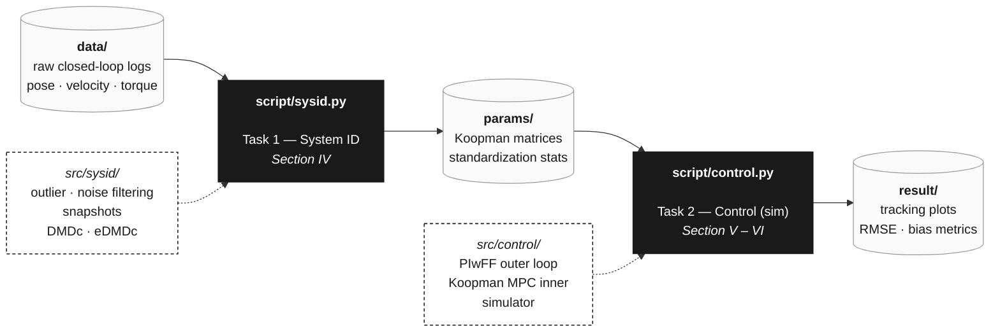

# Hierarchical PIwFF–Koopman-Based MPC for Offset-Free 6-DOF AUV Trajectory Tracking

This repository accompanies the manuscript *"Hierarchical PIwFF–Koopman-Based MPC for Offset-Free 6-DOF AUV Trajectory Tracking: Simulation and Pool Experiments"* (submitted to **IEEE Access**, 2026), and provides the dataset ([download](https://github.com/Tanbjs/Hierarchical-PIwFF-Koopman-Based-MPC-For-AUV/releases/tag/dataset-v0.1)), controller implementation, and simulation/experimental scripts for the **Xplorer-mini** autonomous underwater vehicle (AUV).

## Overview

Accurate six-degree-of-freedom (6-DOF) trajectory tracking of AUVs is hard: the hydrodynamics are nonlinear and cross-coupled, the actuators are constrained, and persistent plant–model mismatch (finite-dimensional Koopman approximation residuals, buoyancy drift, sensor bias) erodes tracking accuracy over time. This project proposes a **hierarchical, data-driven controller** that addresses all three challenges in a single architecture validated in the pool.

## Key Contributions

1. **Closed-loop system identification with DMDc and eDMDc** — A diagonal-transit + sinusoidal-weaving excitation protocol is used to identify both linear (DMDc) and lifted (eDMDc, 27-dim second-order polynomial basis) Koopman models on the Xplorer-mini. eDMDc yields better open-loop prediction, but DMDc is selected for closed-loop control: it delivers comparable tracking at lower computational cost.
2. **Offset-free augmentation of the Koopman MPC** — Integral augmentation in the lifted state jointly rejects Koopman approximation residual and constant external disturbance, eliminating the steady-state bias of nominal Koopman MPC.
3. **Pool-experiment validation** — The proposed controller is benchmarked against a nominal (non-offset-free) Koopman MPC and a tuned cascaded PID–PID baseline on a figure-8 trajectory, in both simulation and real pool experiments on the Xplorer-mini AUV.

## Program Pipeline

This repository ships **two runnable tasks** that consume the released raw dataset and reproduce the simulation results of the paper. Pool experiments reported in *Paper §VI* are conducted on the physical Xplorer-mini AUV and are **outside the scope of this codebase**.

- [src/](src/) — library modules (not directly runnable): primitives for each task.
- [script/](script/) — entry points: one program per task.

Code is **Python (NumPy + CasADi / acados)**.

### Task 1 — System Identification (`script/sysid.py`)
*Paper §IV.* Reads the raw closed-loop logs from [data/](data/), and uses the [src/sysid/](src/sysid/) library to:
1. **Preprocess** — reject outliers and filter sensor noise from the raw logs, then assemble the snapshot matrices `X`, `X+`, `U` (with standardization applied at the regression step).
2. **Identify** the unified Koopman lifted linear model in two variants:
   - **DMDc** — identity lifting; produces a 6×6 linear model in the original velocity coordinates.
   - **eDMDc** — 27-dimensional second-order polynomial basis (linear + quadratic monomials), capturing quadratic drag and Coriolis cross-coupling.
3. **Benchmark** open-loop multi-step prediction (eDMDc wins) vs. closed-loop tracking (DMDc wins on the compute/accuracy trade) and write the chosen model + standardization stats to [params/](params/).

The raw dataset was collected with a cascade PID–PID controller tracking a **diagonal-transit + sinusoidal-weaving** reference, with zero-mean Gaussian perturbation injected on top of the PID command to excite the cross-coupled sway–yaw dynamics.

### Task 2 — Control in Simulation (`script/control.py`)
*Paper §V – §VI.* Loads the identified Koopman model from [params/](params/), and uses the [src/control/](src/control/) library to assemble the cascade controller and run a figure-8 tracking simulation:
- **Outer PIwFF kinematic loop** — converts pose-tracking error into a body-fixed velocity command via inverse-Jacobian feedforward, with componentwise integral clamping to prevent windup.
- **Inner Koopman MPC** — finite-horizon QP over the lifted state, with **integral augmentation** of the output tracking error to drive the persistent bias (Koopman residual + constant disturbance) to zero without a separate observer.
- **Preview command generation** — propagates time-varying references over the prediction horizon so the MPC anticipates high-curvature segments.
- **Terminal cost** from the Discrete Algebraic Riccati Equation; **box constraints** on velocity (1 m/s, 1 rad/s) and torque.
- **Simulator** — nominal 6-DOF AUV dynamics from Appendix A of the paper.

All three controllers — PID–PID baseline, nominal (non-offset-free) Koopman MPC, and the proposed offset-free PIwFF–Koopman MPC — are run on the same figure-8 reference. Tracking plots and error metrics land in [result/](result/).

### Repository Layout

| Path | Role | Contents |
|---|---|---|
| [data/](data/) | input | raw closed-loop excitation logs (downloaded from release) |
| [src/sysid/](src/sysid/) | library | outlier/noise filtering, snapshot builder, DMDc / eDMDc regressors |
| [src/control/](src/control/) | library | PIwFF kinematic loop, offset-free Koopman MPC, preview, simulator |
| [script/sysid.py](script/) | entry point | Task 1 — runs system identification end-to-end |
| [script/control.py](script/) | entry point | Task 2 — runs the controller in simulation |
| [params/](params/) | output | identified Koopman matrices, standardization stats, MPC weights |
| [result/](result/) | output | tracking plots, RMSE/bias metrics, figure-8 trajectories |
| [doc/](doc/) | docs | manuscript draft (`draft0.pdf`) and supporting figures |
