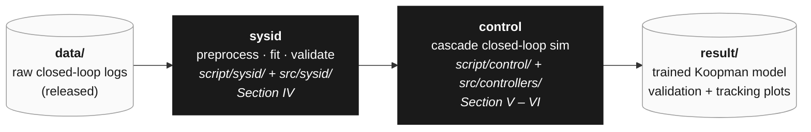

# Hierarchical PIwFF–Koopman-Based MPC for Offset-Free 6-DOF AUV Trajectory Tracking

This repository accompanies the manuscript *"Hierarchical PIwFF–Koopman-Based MPC for Offset-Free 6-DOF AUV Trajectory Tracking: Simulation and Pool Experiments"* (submitted to **IEEE Access**, 2026), and provides the dataset ([download](https://github.com/Tanbjs/Hierarchical-PIwFF-Koopman-Based-MPC-For-AUV/releases/tag/dataset-v0.1)), controller implementation, and simulation/experimental scripts for the **Xplorer-mini** autonomous underwater vehicle (AUV).

## Overview

Accurate six-degree-of-freedom (6-DOF) trajectory tracking of AUVs is hard: the hydrodynamics are nonlinear and cross-coupled, the actuators are constrained, and persistent plant–model mismatch (finite-dimensional Koopman approximation residuals, buoyancy drift, sensor bias) erodes tracking accuracy over time. This project proposes a **hierarchical, data-driven controller** that addresses all three challenges in a single architecture validated in the pool.

## Key Contributions

1. **Closed-loop system identification with DMDc and eDMDc** — A diagonal-transit + sinusoidal-weaving excitation protocol is used to identify both linear (DMDc) and lifted (eDMDc, 27-dim second-order polynomial basis) Koopman models on the Xplorer-mini. eDMDc yields better open-loop prediction, but DMDc is selected for closed-loop control: it delivers comparable tracking at lower computational cost.
2. **Offset-free augmentation of the Koopman MPC** — Integral augmentation in the lifted state jointly rejects Koopman approximation residual and constant external disturbance, eliminating the steady-state bias of nominal Koopman MPC.
3. **Pool-experiment validation** — The proposed controller is benchmarked against a nominal (non-offset-free) Koopman MPC and a tuned cascaded PID–PID baseline on a figure-8 trajectory, in both simulation and real pool experiments on the Xplorer-mini AUV.

## Installation

The codebase is **Python (NumPy + CasADi / acados)**. The Python deps are vanilla `pip install`, but `acados` is **not** on PyPI and must be built from source.

### Prerequisites
- Python **≥ 3.10** (matches the `scipy ≥ 1.15` / `matplotlib ≥ 3.10` floor in [requirement.txt](requirement.txt)).
- A C/C++ toolchain and **CMake** (required to build acados).
- `git`.

### 1. Clone and create a virtual environment

```bash
git clone https://github.com/Tanbjs/Hierarchical-PIwFF-Koopman-Based-MPC-For-AUV.git
cd Hierarchical-PIwFF-Koopman-Based-MPC-For-AUV

python -m venv .venv
source .venv/bin/activate

pip install -r requirement.txt        # NB: filename is singular
```

This pulls the numerics (`numpy`, `scipy`, `pandas`), sysid stack (`scikit-learn`, `joblib`), config + plotting (`pyyaml`, `matplotlib`), and the MPC pieces (`casadi`, `control`, `tabulate`).

### 2. Install acados

`acados_template` is **not on PyPI** — it ships with the acados source tree and only becomes importable after the C library is built. Follow the upstream guide:

- [acados installation](https://docs.acados.org/installation/)
- [acados Python interface](https://docs.acados.org/python_interface/)

Summary:

```bash
git clone https://github.com/acados/acados.git
cd acados && git submodule update --recursive --init
mkdir -p build && cd build
cmake -DACADOS_WITH_QPOASES=ON ..
make install -j4

# expose to your shell (add to ~/.bashrc for persistence)
export ACADOS_SOURCE_DIR=<path-to-acados>
export LD_LIBRARY_PATH=$ACADOS_SOURCE_DIR/lib:$LD_LIBRARY_PATH

# install the Python interface into the same venv
pip install -e $ACADOS_SOURCE_DIR/interfaces/acados_template
```

The first MPC solver build will additionally prompt to download the **t_renderer** binary — accept it.

### 3. Download the dataset

The released CSVs land in [data/dataset/](data/) and are consumed by `script/sysid/preprocess.py`:

```bash
# from the repo root, after creating data/
mkdir -p data
curl -L https://github.com/Tanbjs/Hierarchical-PIwFF-Koopman-Based-MPC-For-AUV/releases/download/dataset-v0.1/dataset.zip -o data/dataset.zip
unzip data/dataset.zip -d data/
rm data/dataset.zip
```

(Or grab the archive manually from the [`dataset-v0.1` release page](https://github.com/Tanbjs/Hierarchical-PIwFF-Koopman-Based-MPC-For-AUV/releases/tag/dataset-v0.1) and extract it so the trial CSVs live under `data/dataset/...`.)

### 4. Smoke test

```bash
python -c "import numpy, scipy, casadi, acados_template; print('ok')"
```

If acados imports cleanly, the cascade controller in `script/control/simulation.py` can build its MPC solver.

## Program Pipeline

The codebase reproduces the **simulation** results of the paper end-to-end from the released raw dataset. Pool experiments reported in *Paper §VI* run on the physical Xplorer-mini AUV and are **outside the scope of this repo**.

The pipeline is a straight line — raw logs in, controller benchmarks out:



- **data** — released closed-loop logs from a cascade PID–PID controller tracking a diagonal-transit + sinusoidal-weaving reference with Gaussian perturbation injected for excitation.
- **sysid** ([doc/sysid.md](doc/sysid.md)) — three scripts: `preprocess.py` (NWU&rarr;NED, Hampel + MA filtering, train/test split) &rarr; `fit.py` (DMDc or eDMDc by OLS) &rarr; `validate.py` (one-step / p-step open-loop prediction vs. a nonlinear baseline). Produces `A`, `B`, scalers, and the validation report.
- **control** ([doc/control.md](doc/control.md)) — `simulation.py` runs three study cases of the cascade controller (PIwFF outer + nominal/offset-free Koopman MPC inner, with a PID–PID baseline) against the Fossen 6-DOF nonlinear plant on a figure-8 reference.
- **result** — trained Koopman matrices under `result/sysid/trained_model/`, validation tables/plots under `result/sysid/validation/`, and per-case tracking figures under `result/control/`.

Configs are hand-authored YAML in [params/](params/) (sysid feature selection, controller gains, AUV physical params); everything under [result/](result/) is derived and disposable.

### Repository Layout

| Path | Role | Contents |
|---|---|---|
| [data/](data/) | input | released `dataset/`, plus generated `raw/ &middot; cleaned/ &middot; smooth/ &middot; split/` from `preprocess.py` |
| [src/sysid/](src/sysid/) | library | filters, polynomial observable, DMDc / EDMDc (OLS), `FittedModel` loader |
| [src/controllers/](src/controllers/) | library | PIwFF outer loop, PID baseline, standard / integral-augmented Koopman MPC, virtual-reference preview |
| [src/utils/](src/utils/) | library | Fossen 6-DOF kinematics + dynamics + RK4, path generators |
| [script/sysid/](script/sysid/) | entry points | `preprocess.py`, `fit.py`, `validate.py` — see [doc/sysid.md](doc/sysid.md) |
| [script/control/](script/control/) | entry point | `simulation.py` — see [doc/control.md](doc/control.md) |
| [params/](params/) | configs | `xplorer_mini.yaml`, `sysid/{dmdc,edmdc}.yaml`, `control/...` controller gains |
| [result/](result/) | outputs | `sysid/trained_model/`, `sysid/validation/`, `control/Case_*/` |
| [doc/](doc/) | docs | manuscript (`draft0.pdf`), stage-by-stage details (`sysid.md`, `control.md`) |
