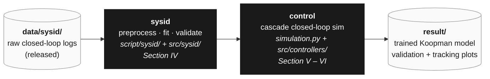

# Hierarchical PIwFF–Koopman-Based MPC for Offset-Free AUV Trajectory Tracking

This repository accompanies the manuscript *"Hierarchical PIwFF–Koopman-Based MPC for Offset-Free AUV Trajectory Tracking: Simulation and Pool Experiments"* (submitted to **IEEE Access**, 2026), and provides the dataset, controller implementation, and simulation/experimental scripts for the **Xplorer-mini** autonomous underwater vehicle (AUV).

📺 **Pool test video:** [Xplorer-mini AUV pool experiment](https://www.youtube.com/watch?v=RqSk-HKhVB4)

## Overview

Accurate trajectory tracking of autonomous underwater vehicles (AUVs) is challenging because nonlinear hydrodynamics, actuator constraints, and persistent plant--model mismatch degrade controller performance. This paper proposes a hierarchical PIwFF--Koopman MPC for offset-free trajectory tracking of the Xplorer-mini AUV. The outer PIwFF loop converts pose-tracking errors into body-fixed velocity commands, while the inner loop uses a Koopman-based linear prediction model to track the corresponding velocity/lifted-state commands subject to constraints. To reduce persistent velocity-output bias caused by finite-dimensional Koopman approximation errors, unmodeled dynamics, and unknown persistent disturbances, the inner MPC is augmented with an output-error integrator. DMDc and eDMDc are compared as prediction models; although eDMDc improves open-loop prediction, DMDc is selected for closed-loop control because it provides comparable tracking performance at a lower computational cost. A preview command is further introduced for time-varying references. Simulation and pool experiments on a figure-8 trajectory show that the proposed controller reduces steady-state bias and improves trajectory tracking relative to the nominal Koopman MPC and PID--PID baselines under the tested conditions.

## Key Contributions

1. **Closed-loop system identification with DMDc and eDMDc** — An identification procedure using a diagonal-transit and sinusoidal-weaving maneuver designed to excite the cross-coupled 6-DOF dynamics, together with an empirical comparison of DMDc and eDMDc in both open-loop prediction and closed-loop tracking that reveals eDMDc to be more accurate in open loop yet DMDc to track better in closed loop, attributed to over-parameterization of the lifted basis.
2. **Offset-free augmentation of the Koopman MPC** — The inner linear MPC is augmented with an integral of the output tracking error in the lifted Koopman state, driving to zero the persistent bias arising jointly from the Koopman approximation residual and constant external disturbance, without requiring a separate observer. A preview component further anticipates time-varying references at the high-curvature points of a figure-8 trajectory.
3. **Pool-experiment validation** — A comparative study of the proposed offset-free hierarchical controller against a nominal (non-offset-free) variant and a cascaded PID baseline in both simulation and pool experiments on the Xplorer-mini AUV.

## Installation

The codebase is **Python (NumPy + CasADi / acados)**. The Python deps are vanilla `pip install`, but `acados` is **not** on PyPI and must be built from source.

### Prerequisites
- Python **3.10.9**.
- A C/C++ toolchain and **CMake** (required to build acados).
- `git`.

### 1. Clone and create a virtual environment

```bash
git clone https://github.com/Tanbjs/Hierarchical-PIwFF-Koopman-Based-MPC-For-AUV.git
cd Hierarchical-PIwFF-Koopman-Based-MPC-For-AUV

python -m venv .venv
source .venv/bin/activate

pip install -r requirement.txt        # NB: filename is singular
```

This pulls the numerics (`numpy`, `scipy`, `pandas`), sysid stack (`scikit-learn`, `joblib`), config + plotting (`pyyaml`, `matplotlib`), and the MPC pieces (`casadi`, `control`, `tabulate`).

### 2. Install acados

`acados_template` is **not on PyPI** — it ships with the acados source tree and only becomes importable after the C library is built. Follow the upstream guide:

- [acados installation](https://docs.acados.org/installation/)
- [acados Python interface](https://docs.acados.org/python_interface/)

Summary:

```bash
git clone https://github.com/acados/acados.git
cd acados && git submodule update --recursive --init
mkdir -p build && cd build
cmake -DACADOS_WITH_QPOASES=ON ..
make install -j4

# expose to your shell (add to ~/.bashrc for persistence)
export ACADOS_SOURCE_DIR=<path-to-acados>
export LD_LIBRARY_PATH=$ACADOS_SOURCE_DIR/lib:$LD_LIBRARY_PATH

# install the Python interface into the same venv
pip install -e $ACADOS_SOURCE_DIR/interfaces/acados_template
```

The first MPC solver build will additionally prompt to download the **t_renderer** binary — accept it.

### 3. Download the data

Two datasets ship as GitHub Release assets (kept out of git). `data/` is split by role — `data/sysid/` (identification) and `data/control/` (closed-loop experiments):

**a. System-identification dataset** (`dataset-v0.1`) — closed-loop CSV logs consumed by `script/sysid/preprocess.py`:

```bash
# from the repo root
mkdir -p data/sysid data/control
curl -L https://github.com/Tanbjs/Hierarchical-PIwFF-Koopman-Based-MPC-For-AUV/releases/download/dataset-v0.1/dataset.zip -o data/dataset.zip
unzip data/dataset.zip -d data/sysid/      # -> data/sysid/dataset/...
rm data/dataset.zip
```

**b. Pool-experiment logs** (`pool_experiment-v0.1`) — ROS2 rosbag2/mcap logs of the §VI figure-8 comparison, consumed by `script/control/pool_experiment.py`:

```bash
curl -L https://github.com/Tanbjs/Hierarchical-PIwFF-Koopman-Based-MPC-For-AUV/releases/download/pool_experiment-v0.1/pool_experiment.zip -o data/pool_experiment.zip
unzip data/pool_experiment.zip -d data/control/       # -> data/control/pool_experiment/...
rm data/pool_experiment.zip
```

(Or grab either archive manually from its release page — [`dataset-v0.1`](https://github.com/Tanbjs/Hierarchical-PIwFF-Koopman-Based-MPC-For-AUV/releases/tag/dataset-v0.1) / [`pool_experiment-v0.1`](https://github.com/Tanbjs/Hierarchical-PIwFF-Koopman-Based-MPC-For-AUV/releases/tag/pool_experiment-v0.1) — and extract so trials live under `data/sysid/dataset/...` and `data/control/pool_experiment/...`.)

### 4. Smoke test

```bash
python -c "import numpy, scipy, casadi, acados_template; print('ok')"
```

If acados imports cleanly, the cascade controller in `script/control/simulation.py` can build its MPC solver.

## Program Pipeline

The codebase reproduces the paper's **simulation** results end-to-end from the released sysid dataset. (The physical pool experiments have their own section, [Pool Experiment](#pool-experiment), below.)

The pipeline is a straight line — raw logs in, controller benchmarks out:



- **data** — released closed-loop logs (`data/sysid/`) from a cascade PID–PID controller tracking a diagonal-transit + sinusoidal-weaving reference with Gaussian perturbation injected for excitation.
- **sysid** ([doc/sysid.md](doc/sysid.md)) — three scripts: `preprocess.py` (NWU&rarr;NED, Hampel + MA filtering, train/test split) &rarr; `fit.py` (DMDc or eDMDc by OLS) &rarr; `validate.py` (one-step / p-step open-loop prediction vs. a nonlinear baseline). Produces `A`, `B`, scalers, and the validation report.
- **control** ([doc/control.md](doc/control.md)) — `simulation.py` runs three study cases of the cascade controller (PIwFF outer + nominal/offset-free Koopman MPC inner, with a PID–PID baseline) against the Fossen 6-DOF nonlinear plant on a figure-8 reference.
- **result** — trained Koopman matrices under `result/sysid/trained_model/`, validation tables/plots under `result/sysid/validation/`, and per-case tracking figures under `result/control/Case_*/`.

Configs are hand-authored YAML in [params/](params/) (sysid feature selection, controller gains, AUV physical params); everything under [result/](result/) is derived and disposable.

## Pool Experiment

Separate from the simulation pipeline above, the repo ships the **pool-experiment comparison** of *Paper §VI* — the headline figure-8 benchmark run on the physical Xplorer-mini AUV. Running the AUV itself is out of scope here; only the **recorded logs** and the **replot script** are included.

`script/control/pool_experiment.py` reads the released ROS2 rosbag2/mcap logs under `data/control/pool_experiment/` (three controllers: PID–PID, Nominal MPC, Offset-Free MPC) and regenerates the 8 IEEE-style comparison figures/tables under `result/control/pool_experiment/` — the same figure set as the simulation cases, but from real-hardware data. The mcap files embed their own ROS2 message schema, so no ROS2 install is required (only `mcap-ros2-support`).

```bash
python script/control/pool_experiment.py
```

## Repository Layout

| Path | Role | Contents |
|---|---|---|
| [data/](data/) | input | split by role: `sysid/dataset/` (released CSVs) + generated `sysid/{raw,cleaned,smooth,split}/` from `preprocess.py`; `control/pool_experiment/` (released mcap logs) |
| [src/sysid/](src/sysid/) | library | filters, polynomial observable, DMDc / EDMDc (OLS), `FittedModel` loader |
| [src/controllers/](src/controllers/) | library | PIwFF outer loop, PID baseline, standard / integral-augmented Koopman MPC, virtual-reference preview |
| [src/utils/](src/utils/) | library | Fossen 6-DOF kinematics + dynamics + RK4, path generators |
| [script/sysid/](script/sysid/) | entry points | `preprocess.py`, `fit.py`, `validate.py` — see [doc/sysid.md](doc/sysid.md) |
| [script/control/](script/control/) | entry points | `simulation.py` (sim), `pool_experiment.py` (pool logs) — see [doc/control.md](doc/control.md) |
| [params/](params/) | configs | `xplorer_mini.yaml`, `sysid/{dmdc,edmdc}.yaml`, `control/...` controller gains |
| [result/](result/) | outputs | `sysid/trained_model/`, `sysid/validation/`, `control/Case_*/`, `control/pool_experiment/` |
| [doc/](doc/) | docs | stage-by-stage details (`sysid.md`, `control.md`) |
