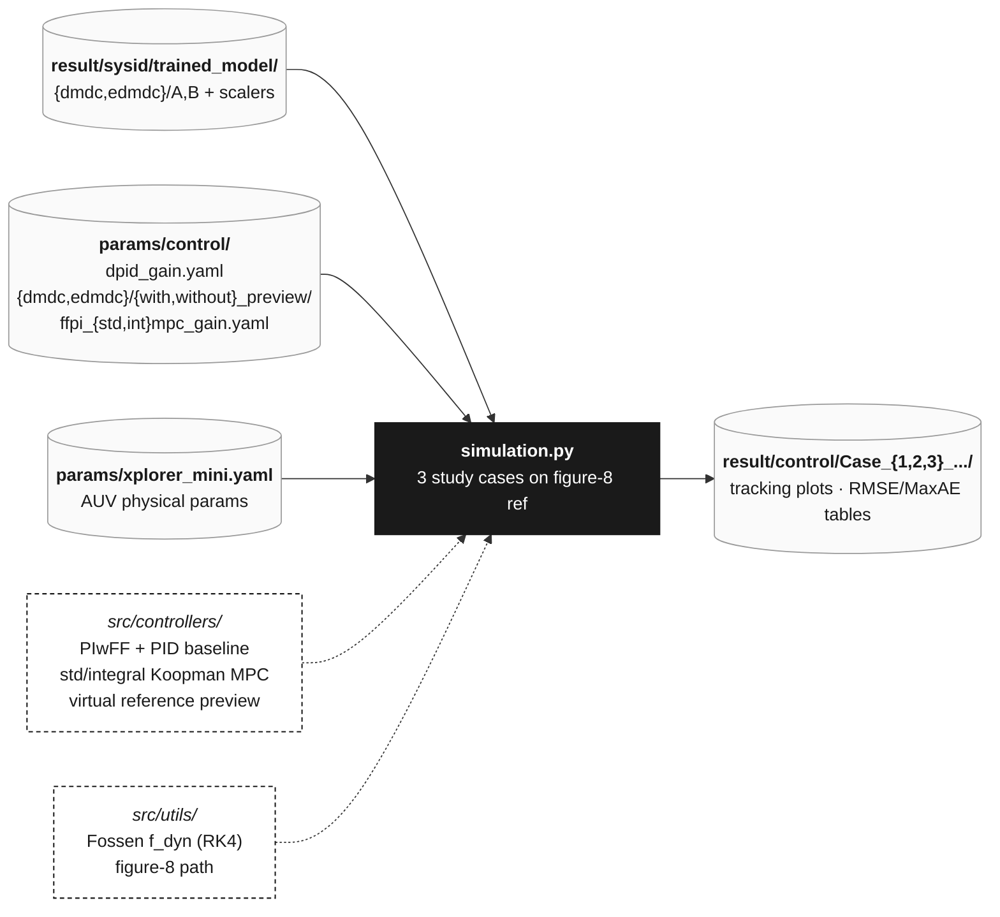

# Closed-Loop Control Simulation — Details

*Paper §V – §VI.* One entry point — [script/control/simulation.py](../script/control/simulation.py) — backed by [src/controllers/](../src/controllers/) (controllers + MPC) and [src/utils/](../src/utils/) (plant, kinematics, reference, plotting).

> **Reproducing the paper.** The YAMLs under [params/control/](../params/control/) — [dpid_gain.yaml](../params/control/dpid_gain.yaml) (PID–PID baseline), [params/control/dmdc/](../params/control/dmdc/) and [params/control/edmdc/](../params/control/edmdc/) (PIwFF outer-loop gains + Koopman MPC weights for std / offset-free, with / without preview) — already encode the gains tuned in paper §V – §VI. Running `python script/control/simulation.py` with the YAMLs as-shipped reproduces the manuscript study cases. Want to **play with the gains** to see how the cascade reacts? Copy a YAML, tweak the PIwFF P/I terms, MPC `Q` / `R` / `QI` weights, or velocity / torque bounds, and re-run — just remember that anything other than the shipped values is no longer the paper configuration.



## Cascade architecture

For each timestep on the figure-8 reference (1 lap, then 40 s of station-keeping), the simulator runs the cascade against the nonlinear plant:

- **Outer PIwFF kinematic loop** — converts pose-tracking error into a body-fixed velocity command via inverse-Jacobian feedforward with **SSA-aware reference differentiation** (`cal_eta_err_with_ssa`) so yaw wrap at the figure-8 lobe crossings doesn't spike the FF term, plus componentwise integral clamping for anti-windup.
- **Inner Koopman MPC** — finite-horizon QP built with `acados`, terminal cost from the discrete algebraic Riccati equation, box constraints on velocity (1 m/s, 1 rad/s) and torque. Two variants:
  - **Standard MPC** (`ffpi_stdmpc_gain.yaml`) — nominal Koopman MPC.
  - **Offset-Free MPC** (`ffpi_intmpc_gain.yaml`) — integral augmentation **in the lifted state** drives the persistent bias (Koopman residual + constant disturbance) to zero without a separate observer.
- **Preview command generation** — rolls the outer loop forward over the prediction horizon (`generate_virtual_reference_ff_pi`) so the inner MPC sees a time-varying `nu`-reference for high-curvature segments.
- **Plant** — Fossen 6-DOF nonlinear dynamics (`f_dyn`) integrated with RK4 in NED, with yaw wrapped to `(-π, π]` each step.

## Study cases

Running

```bash
python script/control/simulation.py
```

executes **three study cases** end-to-end, writing per-case PDFs (state, error, control effort, 3D path, RMSE/MaxAE tables) under `result/control/`:

| Case | Configurations compared | What it tests |
|---|---|---|
| **1** Model accuracy without preview | PIwFF + nominal MPC, DMDc vs. eDMDc | does the heavier lifted model pay off in closed loop? |
| **2** Preview impact, nominal MPC | DMDc nominal MPC, *with* vs. *without* preview | how much does the virtual-reference preview matter? |
| **3** Controller comparison | PID–PID baseline / Nominal Koopman MPC / **Offset-Free Koopman MPC** (all on DMDc with preview) | the headline benchmark — does the lifted integral action remove residual bias? |

## Output figures

Each case directory under `result/control/<Case_Name>/` gets eight artifacts:

| File | Content |
|---|---|
| `1_position_response.pdf` | `eta` tracking vs. reference, 3×2 grid (linear + angular) |
| `2_position_error.pdf` | `e_eta` error trajectories (SSA-wrapped for yaw) |
| `3_velocity_response.pdf` | `nu` tracking vs. outer-loop command |
| `4_velocity_error.pdf` | `e_nu` between commanded and actual body-fixed velocities |
| `5_control_effort.pdf` | generalized force/torque `tau` |
| `6_3d_path.pdf` | 3D figure-8 path comparison (single-column) |
| `7_table_position_metrics.pdf` | RMSE + MaxAE table for `eta` |
| `8_table_velocity_metrics.pdf` | RMSE + MaxAE table for `nu` |
