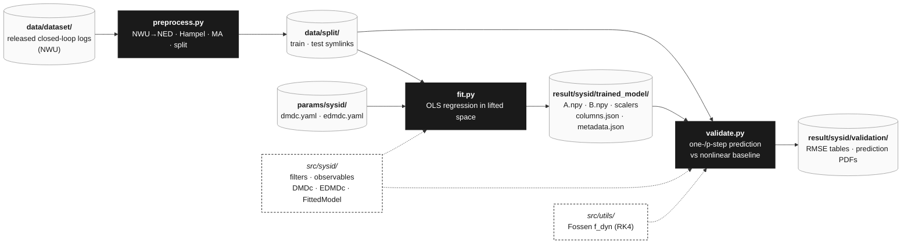

# System Identification — Details

*Paper §IV.* Three sequential scripts under [script/sysid/](../script/sysid/), backed by the [src/sysid/](../src/sysid/) library.



## Stage 1 — Preprocess (`script/sysid/preprocess.py`)

Reads the released CSVs under `data/dataset/` and runs four sequential stages, each writing its own intermediate folder so cleaner/smoother configurations can coexist side-by-side:

1. **dataset &rarr; raw** — inject Euler angles, then flip NWU axes to NED (`data/raw/`). All downstream code operates in NED.
2. **raw &rarr; cleaned** — vectorized Hampel outlier filter (`data/cleaned/.../hampel_window{w}_sigma{n}.csv`).
3. **cleaned &rarr; smooth** — centered moving-average filter (`data/smooth/.../ma_window{w}.csv`).
4. **smooth &rarr; split** — sequential `sklearn.train_test_split` (seed `42`, default ratio `0.85 / 0.15`); output is a tree of relative symlinks at `data/split/{train,test}/...`, mirroring the `kmc` reference pipeline.

Common invocations:

```bash
python script/sysid/preprocess.py
python script/sysid/preprocess.py --hampel-window 5 --hampel-sigma 3 --ma-window 5
python script/sysid/preprocess.py --skip-raw           # reuse existing data/raw/
python script/sysid/preprocess.py --ratio 0.85 0.15 --seed 42
```

## Stage 2 — Fit Koopman model (`script/sysid/fit.py`)

Consumes a YAML config from [params/sysid/](../params/sysid/) (`dmdc.yaml` or `edmdc.yaml`) and the `train` split:

1. Select state / input / output feature columns by name groups; reorder so the **outputs are the first block of the lifted state** (`C = [I 0]`).
2. Fit `StandardScaler` (or `MinMaxScaler`) on the train concatenation; stack one-step pairs `(X_k, U_k, X_{k+1})`.
3. **DMDc** — identity lifting; OLS regression yields a 6×6 `A` and 6×6 `B` in the original velocity coordinates.
4. **eDMDc** — `PolynomialObservable` (default degree 2, no bias, no interaction-only) lifts to a 27-dim basis (linear + quadratic monomials), capturing quadratic drag and Coriolis cross-coupling. OLS regression yields a 27×27 `A` and 27×6 `B`.
5. Persist `A.npy`, `B.npy`, the three scalers (`joblib`), `columns.json`, the full config snapshot, and metadata (sample count, conditioning) under `result/sysid/trained_model/<method>/`.

```bash
python script/sysid/fit.py --config params/sysid/dmdc.yaml
python script/sysid/fit.py --config params/sysid/edmdc.yaml
```

The raw dataset was collected with a cascade PID–PID controller tracking a **diagonal-transit + sinusoidal-weaving** reference, with zero-mean Gaussian perturbation injected on top of the PID command to excite the cross-coupled sway–yaw dynamics. **Regression is OLS only** (no ridge/lasso) — matching the `kmc` reference.

## Stage 3 — Validate (`script/sysid/validate.py`)

Implements the manuscript's open-loop prediction protocol on the held-out `test` split:

- **One-step** and **p-step (default p = 10) sliding-window** prediction for DMDc, eDMDc, and the **nonlinear baseline** (Fossen 6-DOF `f_dyn` integrated with RK4 from [src/utils/](../src/utils/)).
- Per-channel **RMSE** partitioned into the *maneuvering* (`t < 60 s`) and *hovering* (`t ≥ 60 s`) phases used in paper Table 2.
- Per-trajectory and ensemble-averaged metric tables (SVG) plus 3×2 prediction plots (PDF, IEEE Access style) under `result/sysid/validation/`.

```bash
python script/sysid/validate.py                        # default p=10
python script/sysid/validate.py --step 20              # longer horizon
```

**Outcome:** eDMDc wins on open-loop multi-step prediction; DMDc wins on the compute/accuracy trade for closed-loop control, so DMDc is the deployment target.